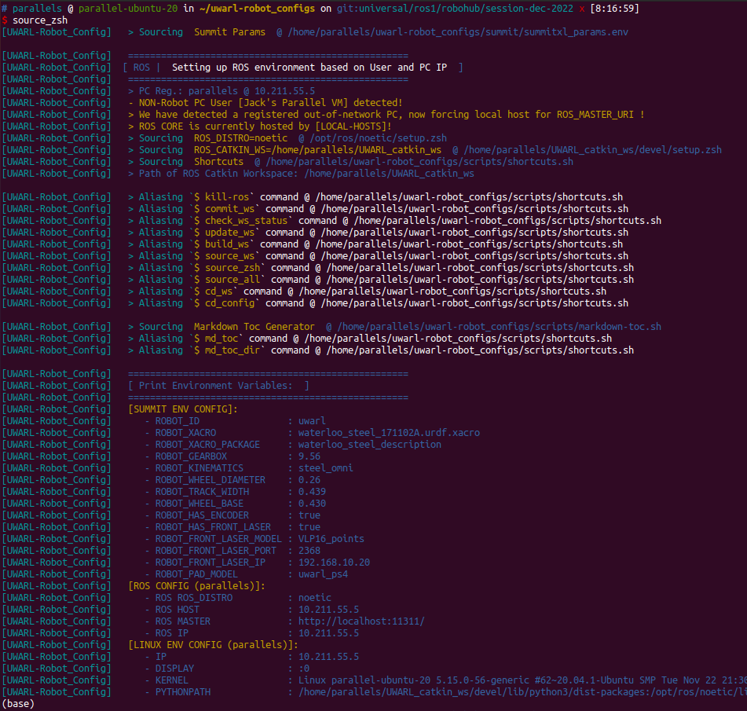

<toc>

# Table of Contents
[*Last generated: Mon 20 Mar 2023 12:01:45 PM EDT*]
- [**1. A brief about `uwarl-robot_configs`**](#1-A-brief-about-uwarl-robot_configs)
  - [1.1 How to Setup Workstation:](#11-How-to-Setup-Workstation)
  - [1.2 How to Setup Platform Hardware:](#12-How-to-Setup-Platform-Hardware)
  - [1.3 How to Use Platform Toolchain and Maintain Workspace:](#13-How-to-Use-Platform-Toolchain-and-Maintain-Workspace)
  - [1.4 How to Launch the Robot:](#14-How-to-Launch-the-Robot)
  - [1.5 How to Modify and Commit to Config Toolchains:](#15-How-to-Modify-and-Commit-to-Config-Toolchains)
- [**2. ⭐ Unified Development :construction:  [Local PC / Summit / WAM] (Melodic/Noetic):**](#2-Unified-Development-construction-Local-PC-Summit-WAM-MelodicNoetic)
  - [2.1 How to commit:](#21-How-to-commit)
  - [2.2 How to Add a new modules under workspace/src:](#22-How-to-Add-a-new-modules-under-workspacesrc)
- [**3. ROS UWARL_catkin_ws Usage Guide:**](#3-ROS-UWARL_catkin_ws-Usage-Guide)
  - [3.1 Modifications:](#31-Modifications)
  - [3.2 Commit and Push:](#32-Commit-and-Push)
  - [3.3 Pull latest repo:](#33-Pull-latest-repo)
  - [3.4 Restart over the catkin workspace:](#34-Restart-over-the-catkin-workspace)
  - [3.5 Shortcuts:](#35-Shortcuts)
- [**3. Tools:**](#3-Tools)
  - [3.1 Remote Desktop Auto-Sleep and Auto-Wake Scheduling:](#31-Remote-Desktop-Auto-Sleep-and-Auto-Wake-Scheduling)
  - [3.2 Remote Desktop without physical monitor (Headless Monitor):](#32-Remote-Desktop-without-physical-monitor-Headless-Monitor)
- [**A. Appendix:**](#A-Appendix)
  - [A.1 File Tree:](#A1-File-Tree)
  - [A.2 ZSHRC Terminal Output After Installing:](#A2-ZSHRC-Terminal-Output-After-Installing)
  - [A.3 Environment Configurations:](#A3-Environment-Configurations)
    - [A.3.1 summitxl_params.env](#A31-summitxl_paramsenv)

---
</toc>


# 1. A brief about `uwarl-robot_configs`

This repo will keep track of the configuration files.
This repo will serve as auto-configuration tool to install `~/UWARL_catkin_ws` from repo: https://github.com/UW-Advanced-Robotics-Lab/UWARL_catkin_ws and load necessary submodules needed per hardware configuration automatically.

> :warning: For more/latest setup tips, please refer to the [Lab Wiki Guide](https://github.com/UW-Advanced-Robotics-Lab/lab-wiki/wiki/Waterloo-Steel%3APlatform-Instructions) for details.

## 1.1 How to Setup Workstation:
Please go to: https://github.com/UW-Advanced-Robotics-Lab/lab-wiki/wiki/Waterloo-Steel%3APlatform-Workstation-Setup

## 1.2 How to Setup Platform Hardware:
Please go to https://github.com/UW-Advanced-Robotics-Lab/lab-wiki/wiki/Waterloo-Steel%3APlatform-Hardware-Setup

## 1.3 How to Use Platform Toolchain and Maintain Workspace:
Please go to https://github.com/UW-Advanced-Robotics-Lab/lab-wiki/wiki/Waterloo-Steel%3APlatform-Development

## 1.4 How to Launch the Robot:
Please go to https://github.com/UW-Advanced-Robotics-Lab/lab-wiki/wiki/Waterloo-Steel%3APlatform-Launch-Instruction

## 1.5 How to Modify and Commit to Config Toolchains:
1. Make sure you checkout your own branch before modifying someone's branch:
   ```bash
   $ cd_config
   $ git branch -v
   #### OUTPUT:
   #     universal/ros1/data-analysis/session-feb-2023 da577d7 [behind 3] [ New: tmux multi session sync launch ] + a shortcut function would auto-launch everything in multiple sub-widows in tmux
   #     universal/ros1/data-analysis/session-jan-2023 616a10f [ begin of data analysis development (jx) ]
   #   * universal/ros1/data-analysis/session-wed-2023 46ab84a [ahead 3] Merge branch 'universal/ros1/data-analysis/session-wed-2023' of github.com:UW-Advanced-Robotics-Lab/uwarl-robot_configs into universal/ros1/data-analysis/session-wed-2023
   #     universal/ros1/robohub/session-dec-2022       25118a9 Merge pull request #8 from UW-Advanced-Robotics-Lab/universal/ros1/robohub/session-dec-2022
   #     universal/ros1/robohub/session-dec-2022-deck  4cb0a25 + deck configs
   #     universal/ros1/robohub/session-jan-2023       012c854 + suspending scripts
   #     waterloo_steel/universal/main                 25118a9 [behind 36] Merge pull request #8 from UW-Advanced-Robotics-Lab/universal/ros1/robohub/session-dec-2022
   
   $ git checkout -b universal/ros1/data-analysis/session-wed-2023_register_my_pc
   $ git push -u origin universal/ros1/data-analysis/session-wed-2023_register_my_pc
   ```
2. Make a PR (Pull Requests) on GitHub UI to merge-in your changes
---
# 2. ⭐ Unified Development :construction:  [Local PC / Summit / WAM] (Melodic/Noetic):

> 🔥 (hot-takes) on **[Hardware v2]** : A unified multi-platform configuration
>
> - `UWARL_catkin_ws/src`:  A single common catkin workspace that can be deployed dynamically across multiple platforms. This repository will track other ROS components as submodules on particular commit hask token (without tracking physical files and changes).
> - `uwarl-robot_configs`: An all-star installation toolkit that will configure any hardware automatically with simple bash scripts.
> - Supported OS: **Ubuntu 18.04** and **Ubuntu 20.04** (includes auto-install for ROS-Noetic)

1. Install Git and configure the environment necessary from previous section, and SSH authenticated with Github, see instruction @ [0.2 SSH Keys & Github](#02-SSH-Keys-Github)

2. Clone configurations: 

   ```zsh
   $ cd ~ && git clone git@github.com:UW-Advanced-Robotics-Lab/uwarl-robot_configs.git
   ```

3. Install the repo with auto-script:

   ```zsh
   $ cd ~ && ./uwarl-robot_configs/scripts/auto-config_UWARL_catkin_ws.zsh
   ```

   > :notebook: this script will install automatically based on the **user name** (e.g. uwarl-orin) to identify the PC space
   >
   > :hot_pepper: It will install ROS Noetic for Ubuntu 20.04 automatically if your system does not have yet!
   > It will install peak can for Jetson and adlink
   > It will install libbarrett for Jetson

4. Build: 

   ```bash
   # update (pull recursively in a batch) of the entire workspace with all required submodules (as noted in common.sh) from anywhere
   $ update_ws
   # build ws from anywhere
   $ build_ws
   # source ws from anywhere
   $ src_ws
   ```

5. (*) For hardware platform setup, please refer to [ [Waterloo-Steel:Platform-Setup.md](./Waterloo-Steel:Platform-Setup.md) ]

## 2.1 How to commit:

1. check every status of subdirectories of the Catkin Workspace:

   ```bash
   $ check_ws_status 
   ```

2. commit changes for every sub-directory (submodule)

   ```bash
   $ cd uwarl-barrrett-ros-pkg 
   $ git status 
   $ git commit -a 
   $ git push
   ```

3. Once you are satisfied with the current version of the workspace, you may commit this specific combination of submodules

   ```bash
   $ cd_ws
   $ commit_ws # it will automatically log all the submodule status for this commit, and prompt any residual modifications
   $ git push
   ```

## 2.2 How to Add a new modules under workspace/src:

1. Add module into workspace

   ```bash
   $ cd_ws
   $ git submodule add git@github.com:UW-Advanced-Robotics-Lab/uwarl-zed_ros_wrapper.git
   $ git commit ### commit: [New Submodule] : zed ros wrapper
   $ git push
   ```

2. Add module name into `uwarl-robot_configs/scripts/common.sh`

   ```bash
   $ cd_config
   $ vim scripts/common.sh
   ## Ex: add zed ros wrapper to wam module
   SUBMODULES_FOR_WAM=(
       "uwarl-barrett-ros-pkg" 
       "uwarl-zed_ros_wrapper" # <----- just added
   )
   ```

3. Update workspace and install ros dependencies:

   ```bash
   $ update_ws
   ```

4. Build:

   ```bash
   $ build_ws
   ```

# 3. ROS UWARL_catkin_ws Usage Guide:

## 3.1 Modifications:

1. switch workspace : `git checkout {branch-name}`
2. add modules: `$ git submodule add {git-repo}`
3. remove submodules: `$ git submodule deinit {git-repo}` and you may need delete the submodules in `.gitmodules` file
4. Create a new branch of workspace: `git checkout -b waterloo_steel/adlink-mxe211-melodic/{node}/{feature}`

## 3.2 Commit and Push:

1. Commit all changes under submodules
2. Make sure you run this: `$ ./git-status-all.sh` to log all status into `git-status-all.log`
3. commit all current workspace changes: `$ git add . && git commit -a`
4. Push workspace `$ git push` or upload a branch `$ git push -u {your-branch-name}`

## 3.3 Pull latest repo:

```bash
$ cd_ws/src && git status # make sure no local changes
$ update_ws
```

## 3.4 Restart over the catkin workspace:

```bash
# delete current workspace
$ cd $HOME
$ rm -rf UWARL_catkin_ws 
# reinstall everything and build:
$ cd_config
$ ./scripts/auto-config_UWARL_catkin_ws.zsh
$ build_ws
$ source_ws
```

## 3.5 Shortcuts:

```bash
### ROS Workspace Specific:
## Note: you may add optional arguments afterwards.
# update (pull recursively in a batch) of the entire workspace with all required submodules (as noted in common.sh) from anywhere
$ update_ws
# clean ws from anywhere (build files from catkin-build)
$ clean_ws
# build ws from anywhere (w/ catkin-build)
$ build_ws
# source ws from anywhere
$ source_ws
# source ~/.zshrc from anywhere
$ source_zsh
# cd into workspace from anywhere
$ cd_ws
# check wworkspace status from anywhere
$ check_ws_status
# commit the current workspace milestone:
$ commit_ws
# cd into robot_configs from anywhere
$ cd_config

### Git Related:
# pretty compact git log tree:
$ git_log
# ...  and include line changes:
$ git_log -p

# auto-gen Table of Contents for a specific markdown file
$ md_toc README.md 
# auto-gen Table of Contents for a specific directory containing all markdown files
$ md_toc_dir docs
# auto-gen ToC for MODIFIED Changes Only based on git status
$ md_toc_dir git
```

# 3. Tools:
## 3.1 Remote Desktop Auto-Sleep and Auto-Wake Scheduling:

```bash
$ sudo cp ~/uwarl-robot_configs/desktop/suspend_until $HOME
# Takes a 24hour time HH:MM as its argument
# Example:
#
$ suspend_until 9:30
#     suspend_until 18:45
#
# You can create a root cron job that calls this script to execute at a
# specific time in the evening and then awake in the morning:
#
$ sudo crontab -e
#
# Now enter something like to run the suspend script at 23:30:
#
30 23 * * * /home/myhomefolder/suspend_until 07:30 
```

## 3.2 Remote Desktop without physical monitor (Headless Monitor):
```bash
$ sudo apt-get install xserver-xorg-video-dummy -y 
$ sudo cp ~/uwarl-robot_configs/desktop/etc/X11/xorg.conf /etc/X11/xorg.conf
```

# A. Appendix:

## A.1 File Tree:

```bash
# lastly modified by Jack [Nov. 25, 2022] @[#6c20a3]
.
.
├── docs                                              # [documents]
│   └── media                                              # : media folders
│       └── zshrc_terminal_output_dec_01_2022.png
├── README.md                                              # : instructions
├── scripts                                           # [bash scripts]
│   ├── auto-config_UWARL_catkin_ws.zsh                    # : auto-install `UWARL_catkin_ws`
│   ├── auto-install_xrdp_screen.sh                        # : install xrdp screen
│   ├── common.sh                                          # : common configurations
│   ├── git_functions.sh                                   # : some bash functions
│   └── shortcuts.sh                                       # : aliased shortcuts
├── summit                                            # [summit specific]
│   ├── install_geographiclib_datasets.sh                  # : a necessary script to config summit
│   ├── rgbd_summit.rviz                                   # : rviz [ARCHIVED]
│   ├── ros-melodic-robotnik-msgs_2.2.0-0bionic_amd64.deb  # : a custom built deb package for melodic summit hardware
│   ├── summitxl_params.env                                # : summit parameters
│   └── user_services                                      # [user system services]
│       ├── environment                                         # : `./ros/environment` to configure ros namespace at the boot (for auto-launching services)
│       ├── README.md                                           # : Guide
│       ├── roscorelaunch@.service                              # : create `roscore + launch` systemctl service
│       ├── roscore.service                                     # : create `roscore` systemctl service
│       └── roslaunch@.service                                  # : create `roslaunch` systemctl service
└── wam                                               # [wam specific]
    └── barrett.zip                                        # : a zip copy of barrett config       
```

## A.2 ZSHRC Terminal Output After Installing:


## A.3 Environment Configurations:

### A.3.1 summitxl_params.env

Robot Configuration Description:
   
```
     - ROBOT_ID indicates the name of the robot. This is the name of the namespace under all the nodes will be working. This is also used as the prefix of all the subcomponents.(*summit_xl*)

     - ROBOT_XACRO indicates the path where the xacro file is. (inside the robot folder in robot_description)(*summit_xl.urdf.xacro*)
 
     - ROBOT_FRONT_LASER_MODEL indicates the model of the laser that the robot is using. The model is the name of the launch file.(*sick_tim561/hokuyo_ug01/hokuyo_ust*)
 
     - ROBOT_REAR_LASER_MODEL indicates the model of the laser that the robot is using. The model is the name of the launch file.(*sick_tim561/hokuyo_ug01/hokuyo_ust*)
 
     - ROBOT_HAS_FRONT_LASER indicates if the robot has a laser in front. (*true/false*)
 
     - ROBOT_HAS_REAR_LASER indicates if the robot has a laser in rear. (*true/false*)
 
     - ROBOT_HAS_FRONT_PTZ_CAMERA indicates if the robot has the ptz camera in front. (*true/false*)
 
     - ROBOT_HAS_REAR_PTZ_CAMERA indicates if the robot has the ptz camera in front. (*true/false*)
 
     - ROBOT_HAS_GPS indicates if the robot has gps. (*true/false*)
 
     - ROBOT_HAS_FRONT_RGBD_CAMERA indicates if the robot has a front rgbd camera. (*true/false*)
 
     - ROBOT_FRONT_RGBD_CAMERA_ID camera id to identify in the bus
 
     - ROBOT_HAS_REAR_RGBD_CAMERA indicates if the robot has a front rgbd camera. (*true/false*)
 
     - ROBOT_REAR_RGBD_CAMERA_ID camera id to identify in the bus
 
     - ROBOT_PAD_MODEL pad model used. (*ps4/ps3/logitechf710/xbox360*)
 
     - ROBOT_GEARBOX establishes the motor gearbox value. (*24V: 12.52 | 48V: 9.56*)
 
     - ROBOT_HAS_ENCODER indicates if the robot has encoders. (*true/false*)
 
     - ROBOT_KINEMATICS kinematic configuration of the robot. (*skid/omni/steel_skid/steel_omni*)
 
     - ROBOT_HAS_ARM indicates if the robot has an arm (*true/false*
```


<eof>

---
[*> Back To Top <*](#Table-of-Contents)
</eof>